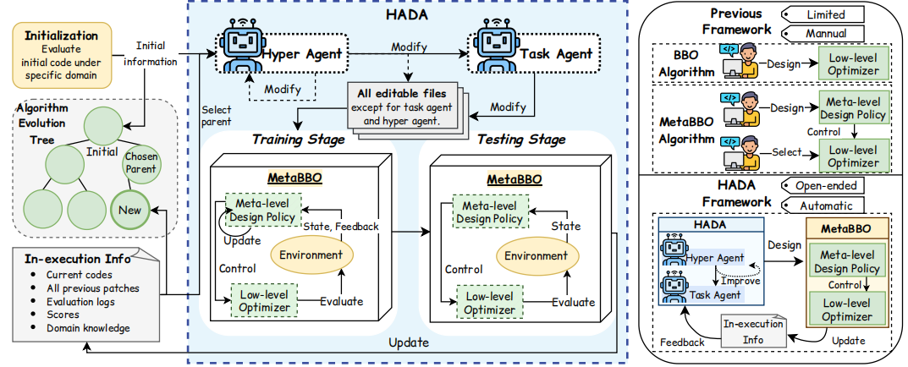
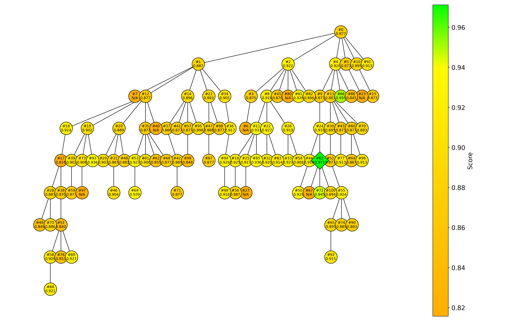
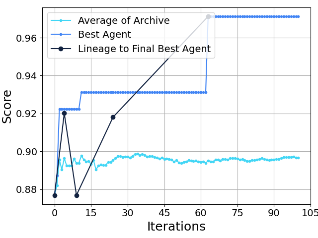

# Hyper Algorithm Design Agent (HADA)


This repo provides the implementation of HADA (Hyper Algorithm Design Agent). HADA automates the design of Meta-Black-Box Optimization (MetaBBO) algorithms through open-ended recursive program evolution. We provide following step-by-step instructions for you to try HADA on your PC or Server.

## Quick Start

### 0. Prepare a ubuntu 24.04.4 LTS system


### 1. Prepare your API Key
Fill in your API Key in the env.txt file and rename it to .env

### 2. Create virtual environment

```bash
python3 -m venv venv_nat
source venv_nat/bin/activate
pip install -r requirements.txt
```

### 3. Build Docker Image

```bash
docker build -t hada -f Dockerfile .
```

### 4. Initialize Git Repository

```bash
git init
git add .
git commit -m "Initial commit"
```

### 5. Run Initial Evaluation

Run initial evaluation to establish baseline performance:

```bash
# Run all domains
bash setup_initial.sh

# Or run specific domain only
bash setup_initial.sh bbob_unconstrained
bash setup_initial.sh bbob_constrained
bash setup_initial.sh metabox_mo
```
An initial evluation output folder will show up in ./outputs/ after the above operation.


### 6. Start HADA Generation Loop

```bash
python generate_loop.py --domains bbob_unconstrained --max_generation 100
```

## Supported Domains

- `bbob_unconstrained`: BBOB unconstrained optimization problems
- `bbob_constrained`: BBOB constrained optimization problems
- `metabox_mo`: WFG multi-objective optimization problems

## Project Structure

```
HADA/
├── Dockerfile              # Docker image build file
├── setup_initial.sh        # Initial evaluation script
├── generate_loop.py        # Main generation loop entry
├── metabbo/                # DQN-DE core implementation
│   ├── ec_algorithm.py     # DE optimizer
│   ├── meta_learning.py    # DQN controller
│   └── meta_learning_env.py # RL environment wrapper
├── domains/                # Evaluation logic for each domain
│   ├── bbob_unconstrained/
│   ├── bbob_constrained/
│   └── metabox_mo/
└── outputs/                # Evaluation output directory
```

## Main Parameters

`generate_loop.py` supports the following parameters:

- `--domains`: Domains to optimize (comma-separated)
- `--max_generation`: Maximum number of generations
- `--parent_selection`: Parent selection strategy (score_prop/score_child_prop/random/latest/best)


## Output

For each evolution step, HADA generates a in-execution information folder (named by `gen_xx`) in the `outputs/` directory, which includes:

- `hyper_agent_chat_history.md`: the LLM conversation history for hyper agent.
- `chat_history_task_agent.md`: the LLM conversation history for task agent.
- `hyper_agent_patch.diff`: The patches made at current step in hyper agent.
- `all_patch.diff`: The patches made at current step in task agent and metabbo.
- `report.json`: Evaluation report
- `predictions.csv`: The optimization results (performance score) of the current metabbo on the target domain.
- `{domain}_return_curves.png`: Training return curves of the metabbo.
- `{domain}_loss_curves.png`: Training loss curves of the metabbo.

There are also two important experimental progress file you need to pay attention, they are dynamically updated along HADA's running:
- `archive_graph_bbob_unconstrained_train_agent.png`: the algorithm evolution tree updated at each step.
- `progress_plot_bbob_unconstrained_train_agent.png`: the performance progress curve of HADA-evolved metabbo updated at each step.



